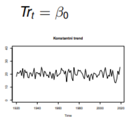
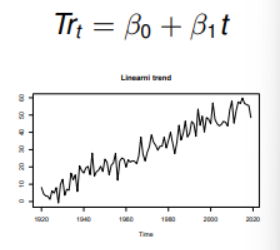
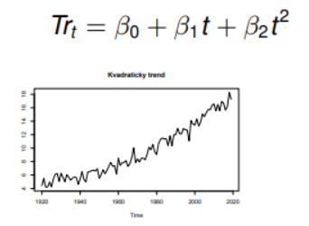
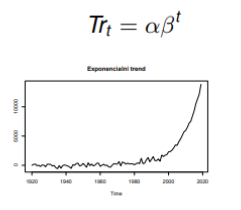
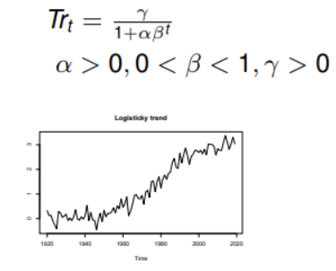
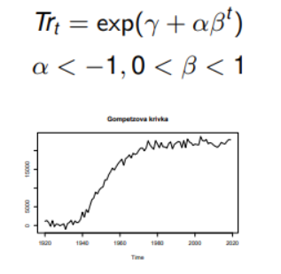

# **Ůvod**

## Časová řada

-   soubor pozorování jedné náhodné veličiny

-   pozorování závislá na čase

-   intervaly mezi měřeními jsou stejné

-   **Cíle:**

    -   Pochopení vlastností řady (sezónnost, trend, cykličnost, závislosti pozorování, ...)

    -   Předpovědi z minulých hodnot a vlastností

    -   Pochopení závislostí různých časových řad

-   Řada se řídí jedním z modelů:

    -   **Aditivní model**

        -   Předpokládá, že jednotlivé složky časové řady jsou sečteny dohromady.

        -   Lineární vztah složek

    -   **Multiplikativní model**

        -   Předpokládá, že jednotlivé složky časové řady se navzájem násobí.

        -   Nelineární vztah složek

<br><br>

# **Časové trendy**

-   Existují různé druhy trendů. (thats it)

## Konstantní trend



## Lineární trend



## Kvadratický trend



## Exponenciální trend



## Logistický trend



## Gompertzova křivka



<br><br>

# **Model**

-   Model je náš odhadnutý předpis pro časovou řadu

-   Snažíme se ho zjistit pro předpovědi časové řady (případně vztahy proměnných, doplnění mezer, ...)

## Hodnocení modelu

-   U všech následujících měření se snažím docílit co nejnižšího skóre.

```{=html}
<!-- -->
```
-   **AIC** (Akaikeho informační kritérium)

    -   Preferuje složitější modely

-   **AICc** (Akaikeho informační kritérium pro malé vzorky)

    -   Doslova AIC pro malé vzorky

-   **BIC** (Bayesovské informační kritérium)

    -   preferuje jednodušší modely

<br><br>

# **Vyhlazení časových řad**

-   Adaptivní přístup k trendové složce.

-   Data se vyhladí (odstraní se šum) aby byl lépe vidět trend nebo sezónnost.

## Metoda klouzavých průměrů

-   Nejjednodušší adaptivní přístup

-   Vhodný **pro stabilní trendy**

-   2 parametry:

    -   **Délka**

        -   Větší délka = hladší křivka

    -   **Řád**

        -   Typ průměru který se využije

        -   Hlavně: **jednoduchý klouzavý průměr** a **vážený klouzavý průměr**(větší váha novějším pozorováním)

```{r message=FALSE, warning=FALSE}
# Příprava libtardies a dat
install.packages(c('TTR', 'zoo', 'forecast'))
library(TTR)
library(zoo)
library(forecast)
kings <- scan("http://robjhyndman.com/tsdldata/misc/kings.dat",skip=3)
# veky, ve kterych zemreli anglicti kralove
kings.ts <- ts(kings)
plot(kings.ts)
```

```{r}
# klouzave prumery prvniho radu ruzne delky
# první řád = jednoduchý klouzavý průměr
kings.rm3<-rollmean(kings.ts,3)
kings.rm5<-rollmean(kings.ts,5)
kings.rm7<-rollmean(kings.ts,7)
kings.rm9<-rollmean(kings.ts,9)
kings.rm11<-rollmean(kings.ts,11)
  # pro krajni body odhady nejsou

plot(kings.ts)
lines(kings.rm3,col=2)
lines(kings.rm5,col=3)
lines(kings.rm7,col=4)
lines(kings.rm9,col=5)
lines(kings.rm11,col=6)
legend(34,40,legend=c("puvodni rada","KP 3","KP 5","KP 7","KP 9","KP 11"),
       lty=1,col=1:6,cex=0.8)
```

```{r}
# klouzave prumery tretiho radu
# třetí řád = vážený klouzavý průměr
vahy<-(1/35)*c(-3,12,17,12,-3)
kings.rm3.5<-rollapply(kings.ts, 5, 
                    function(z){return(weighted_mean = weighted.mean(z,vahy))})
vahy<-(1/231)*c(-21,14,39,54,59,54,39,14,-21)
kings.rm3.9<-rollapply(kings.ts, 9, 
                    function(z){return(weighted_mean = weighted.mean(z,vahy))})

plot(kings.ts)
lines(kings.rm3.5,col=2)
lines(kings.rm3.9,col=3)
```

```{r}
### funkcne zapsatelny trend
# pokud jsme tvar trendu schopni odhadnout z dat, je mozne pocitat primo model zavislosti na case
cas<-1:42
cas2<-cas*cas
cas3<-cas2*cas

lin.trend<-lm(kings~cas)
kv.trend<-lm(kings~cas+cas2)
kub.trend<-lm(kings~cas+cas2+cas3)


plot(kings.ts)
abline(lin.trend,col=2)
lines(cas,fitted(kv.trend),col=3)
lines(cas,fitted(kub.trend),col=4)
legend(34,40,legend=c("puvodni rada","linearni trend","kvadraticky trend","kubicky trend"),lty=1,col=1:4,cex=0.7)
```

```{r}
# porovnani, ktery trend je lepsi
summary(lin.trend)$r.squared
summary(kv.trend)$r.squared
summary(kub.trend)$r.squared
  # procento variability vysvetlene modelem
```

```{r}
AIC(lin.trend)
AIC(kv.trend)
AIC(kub.trend)
  # Akaikeho informacni kriterium - cim mensi tim lepsi
BIC(lin.trend)
BIC(kv.trend)
BIC(kub.trend)
```

<br><br>

# **Nadpis**

<br><br>

# **Nadpis**

<br><br>

# **Nadpis**

<br><br>

# **Nadpis**

<br><br>

# **Nadpis**
